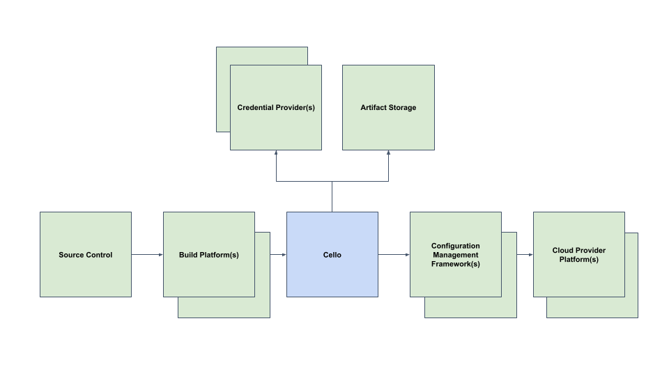

## Definitions

- **Framework** defines the cloud configuration management framework (terraform, cdk).
- **Operation** is an abstraction of the type of command to execute. Supports **sync** and **diff**.
- **Code Archive** is a zip file which contains the framework code for the operation.
- **Projects** define a logical grouping of targets.
- **Targets** are cloud providers (AWS account, etc) affected by an operation.
- **Workflow Template** template of steps to be taken when running a frameowrk command (diff or sync).
- **Workflows** execution of workflow template.
- **Arguments** are passed to the operation. Can be supplied for **init** and / or **execute**.
- **Parameters** are passed as inputs to the workflow template.
- **Environment Variables** are set in the shell before the operation. These will vary based on the workflow.
- **Images** are docker images executed by the workflow.
- **Credentials Provider** generates short lived credential tokens exchanged for cloud credentials.
- **Token** are used to provide access (multiple types exist, see below for details).

## Access and Tokens

All access is via secrets known as a **token**.

There are multiple types of tokens which can be used by Cello.

- **Admin Token** Provides access to manage projects and targets (admin tokens do not have the
  ability to perform operational commands). The admin token has the format **PROVIDER:admin:SECRET**. The admin token is set as an
  environment variable which is read by the service at startup. The admin token is passed in the **Authorization** header to the service.

- **User Tokens** Grants access to operational commands (sync, diff, etc) for a given
  project. User tokens do not have the ability to manage the associated project or targets. User tokens have the format **PROVIDER:USER:SECRET**. User tokens are passed in the **Authorization** header to
  the service.

- **Credential Tokens** Are used to obtain target credentials. Credential tokens are short lived and limited use tokens. They are generated and passed to the workflow during an operation. The token is then exchanged (via the credential provider) for target credentials (AWS credentials, etc). Credential tokens have a format based on the provider and should be considered opaque (for example vault **s.ABCDEFGHIJKLMNOPQRSTUVWXYZ**). Credentials tokens are
  passed from the credential provider to the service and then on to the workflow.

## State

All state is stored in the credential provider (Vault) and Argo Workflows.

## Operations

Operations are converted to the equivalent command in the target framework.

- Terraform

  - **Sync**: init, apply
  - **Diff**: init, plan

- CDK
  - **Sync**: deploy
  - **Diff**: diff

Additionally you can define your own frameworks in **argo-cloudops.yaml**.

## Workflow

Cello uses [Argo Workflows](https://argoproj.github.io/argo-workflows/) as its workflow engine. To execute the provided command, an Argo workflow
is submitted by the service. Ordinary users should not need to access Argo workflows directly. Workflows
are stored as Argo Workflow Templates. Currently there is one generic workflow for all commands which
performs one step which executes the image provided with the command, arguments and environment variables.

## Config

The config file contains the commands executed by different frameworks. The example config in
[argo-cloudops.yaml](https://github.com/cello-proj/cello/blob/main/argo-cloudops.yaml) contains the default commands to
run **cdk** and **terraform**.
